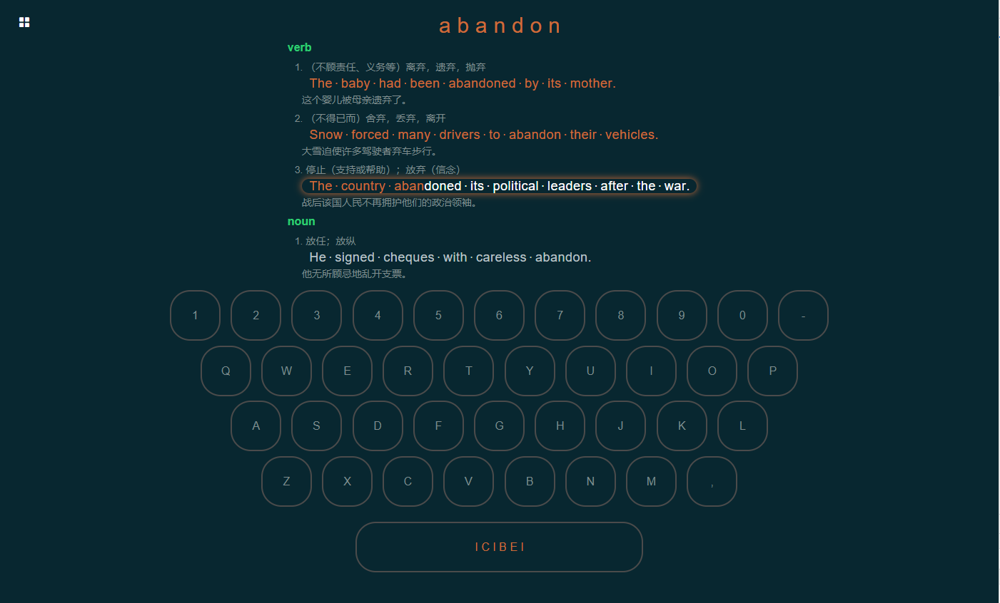

[](https://opensource.org/licenses/Apache-2.0)
[]()
[]()
[]()
[]()

## 项目介绍

ICIBEI爱词贝，源于个人的一个小小idea，旨在帮助用户通过眼看、耳听、手敲并行的方式不断练习，在不知不觉中形成对单词和键盘键位的肌肉记忆。

是一个基于微服务架构的前后端分离系统。前台使用Vue + Element , 后端使用spring boot + spring cloud + mybatis-plus进行开发，使用 Jwt + Spring Security + OAuth2 实现登录授权和访问鉴权，使用 SpringCloud Gateway 实现动态网关，引入 Nacos（服务发现和配置中心）、 Feign（基于Http协议的RPC）、 Sentinel(分布式系统的流量防卫兵)、 RabbitMQ（消息队列）、 Redis 等中间件。[在线预览](http://www.neverth.fun)


## ICIBEI目录结构

```
├── .mvn                    --maven包装器，方便保证maven版本一致
├── authentication-server   --鉴权模块，验证jwt是否有效、用户是否有权限访问路径等
├── authorization-server    --授权模块，提供用户登录返回JWT操作
├── common            
│   ├── core                  --所有项目的核心类库
│   ├── web                   --针对WEB项目的核心类库
├── doc                     --文档
├── gateway-admin           --网关管理模块，主要用于对网关路由的CRUD 
├── gateway-web             --网关模块，所有访问的入口，实现路由转发和调用鉴权模块鉴权功能
├── icibei-web              --icibei网站端服务
├── organization            --组织管理模块，主要是用户、角色、资源等CRUD操作，后续会将无关CRUD转移到icibei-web模块
├── script                 
│   ├── baidu_translate       --百度翻译爬虫
├── webapp                  --icibei的前端项目，基于VUE
```

## ICIBEI子模块目录结构

```
├── src                    
│   ├── main                  
│   │   ├── java           
│   │   │   ├── config           --配置类
│   │   │   ├── dao              --数据操作层
│   │   │   ├── service          --业务逻辑层
│   │   │   ├── provider         --调用第三方服务的提供类
│   │   │   ├── controller       --接口controller
│   │   │   ├── entity           --实体类
│   │   │   │   ├── form           --前端提供的表单实体
│   │   │   │   ├── param          --前端提供的参数实体
│   │   │   │   ├── po             --对应数据库表的PO实体类
│   │   │   │   └── vo             --返回给前端的视图实体
│   │   │   ├── event            --事件或消息处理类
│   │   │   ├── exception        --异常处理相关类
│   │   │   ├── filter           --拦截器相关类
│   │   └── resources          --配置文件目录 
│   │       ├── application.yml  --springboot的应用配置文件
│   │       └── bootstrap.yml    --springboot的配置文件
│   └── test                   --测试目录
│       ├── java               
│       └── resources       
│          └── application.yml 
├── pom.xml                  --maven配置文件
```

## ICIBEI前端目录结构

```

```

### TODO LIST
